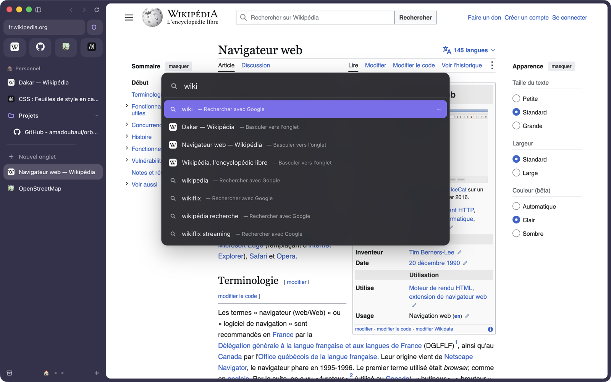
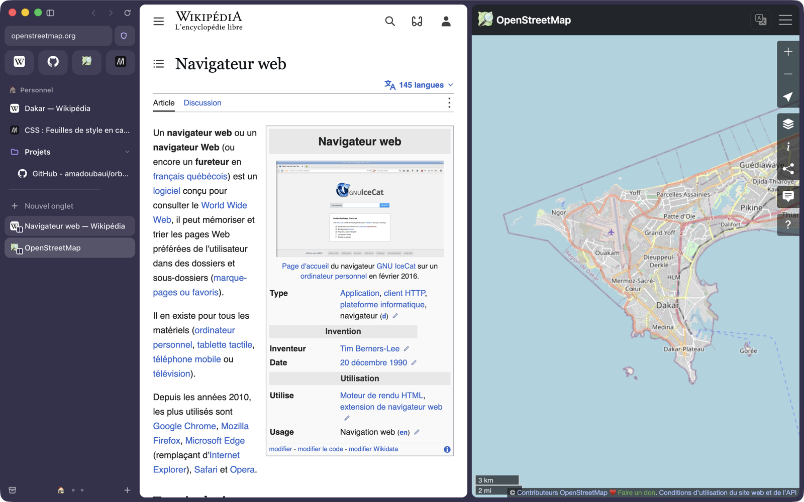
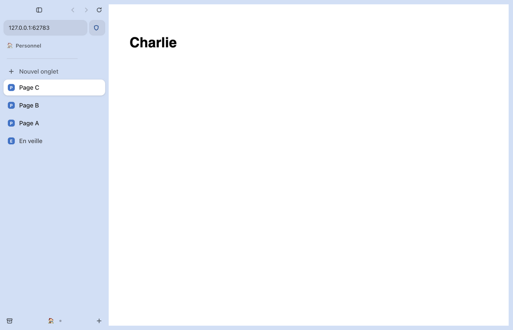

# Orbe

**Un navigateur à barre latérale, en français, bâti sur Chromium.**

Orbe reprend l'organisation et les raccourcis clavier du navigateur Arc — barre
latérale, Espaces, onglets épinglés, barre de commande, vue scindée — avec une
interface entièrement en français (anglais disponible dans les réglages).

> Projet libre et indépendant, sans lien avec The Browser Company. Orbe ne
> contient aucun code ni aucune ressource d'Arc : tout est réécrit.

État : **version 0.3, macOS**. Windows viendra ensuite.



| Vue scindée | Thème clair |
| --- | --- |
|  |  |

## Ce qui fonctionne

- **Barre latérale** : favoris en tuiles, onglets épinglés, dossiers, onglets du
  jour, glisser-déposer, renommage sur place, largeur réglable, masquage (⌘S)
  avec réapparition au survol du bord gauche.
- **Espaces** : couleur et icône par Espace, changement par ⌃1…⌃9, ⌥⌘←/→ ou
  balayage à deux doigts sur la barre latérale.
- **Barre de commande** (⌘T / ⌘L) : adresse, recherche, bascule vers un onglet
  ouvert, historique, actions, suggestions du moteur de recherche.
- **Vue scindée** jusqu'à quatre volets (⌃⇧=).
- **Aperçu des liens (Peek)** : un lien sortant d'un onglet épinglé, ou un
  ⇧clic, s'ouvre par-dessus la page ; ⌘O en fait un onglet, Échap le ferme.
- **Profils** : cookies, connexions et favoris séparés, un profil par Espace.
- **Import depuis Arc** : Espaces, épinglés, dossiers, favoris et profils
  (menu Orbe → Importer depuis Arc…).
- **Vidéo et son** : la vidéo en cours passe en image dans l'image quand tu
  changes d'onglet ; un lecteur miniature dans la barre latérale pilote le son.
- **Bloqueur de publicités et de traqueurs** intégré (24 000 domaines, moins
  d'une microseconde par requête), avec exception par site depuis le bouclier.
- **Archive** : ⌘W archive l'onglet, ⇧⌘T le rouvre, les onglets inactifs sont
  archivés automatiquement (12 h par défaut).
- **Petite fenêtre** (⌥⌘N), **navigation privée** (⇧⌘N), plusieurs fenêtres
  partageant la même barre latérale.
- **Bibliothèque** : historique, archive, téléchargements.
- Recherche dans la page, zoom, capture, impression, outils de développement,
  autorisations par site, mise en veille des onglets anciens.
- **Français et anglais**, thème clair, sombre ou automatique.

## Raccourcis clavier

Identiques à ceux d'Arc. La liste complète est dans l'application :
*Aide → Raccourcis clavier essentiels*.

| Action | Raccourci |
| --- | --- |
| Nouvel onglet / barre de commande | ⌘T / ⌘L |
| Archiver l'onglet / le rouvrir | ⌘W / ⇧⌘T |
| Épingler ou désépingler | ⌘D |
| Onglet suivant / précédent | ⌥⌘↓ / ⌥⌘↑ |
| Onglets récents | ⌃⇥ (maintenir ⌃) |
| Aller à l'onglet 1…9 | ⌘1 … ⌘9 |
| Espace suivant / précédent | ⌥⌘→ / ⌥⌘← |
| Aller à l'Espace 1…9 | ⌃1 … ⌃9 |
| Masquer la barre latérale | ⌘S |
| Barre d'outils | ⇧⌘D |
| Vue scindée / fermer le volet | ⌃⇧= / ⌃⇧- |
| Copier l'URL / en Markdown | ⇧⌘C / ⌥⇧⌘C |
| Effacer Aujourd'hui | ⇧⌘K |
| Petite fenêtre / navigation privée | ⌥⌘N / ⇧⌘N |
| Historique / bibliothèque / téléchargements | ⌘Y / ⇧⌘L / ⇧⌘J |
| Capturer la page | ⇧⌘2 |
| Réglages | ⌘, |

## Lancer Orbe depuis les sources

Il faut [Node.js](https://nodejs.org) 20 ou plus récent.

```sh
git clone https://github.com/amadoubaui/orbe.git
cd orbe
npm start        # lance le navigateur
npm test         # tests de bout en bout (72 vérifications)
npm run test:ui  # tests d'interface Playwright, souris et clavier réels (137 vérifications)
npm run build    # fabrique ~/.orbe-dev/dist/Orbe.app (-- --install pour /Applications)
```

Au premier lancement, le moteur (Electron) est téléchargé dans `~/.orbe-dev`,
en dehors du projet. Les données du navigateur sont dans
`~/Library/Application Support/Orbe`.

## Organisation du code

```
src/main/       processus principal : fenêtres, onglets, menus, données
src/preload/    pont sécurisé entre l'interface et le processus principal
src/renderer/   interface : barre latérale, barre de commande, pages internes
src/shared/     textes français et anglais
tests/          tests de bout en bout, tests d'interface (Playwright), sites réels
docs/           analyse d'Arc et feuille de route
```

Pas de framework ni d'étape de compilation : du JavaScript, du HTML et du CSS
simples, pour un démarrage rapide et une interface fluide.

## Feuille de route

Voir [docs/feuille-de-route.md](docs/feuille-de-route.md). Les prochains
chantiers : extensions Chrome, synchronisation, puis la version Windows.

## Licence

Le code est sous licence [MIT](LICENSE). La liste de blocage
(`assets/blocklist.txt`) réunit des listes publiques qui gardent chacune leur
licence (MIT et CC BY 3.0), rappelée en tête du fichier.
